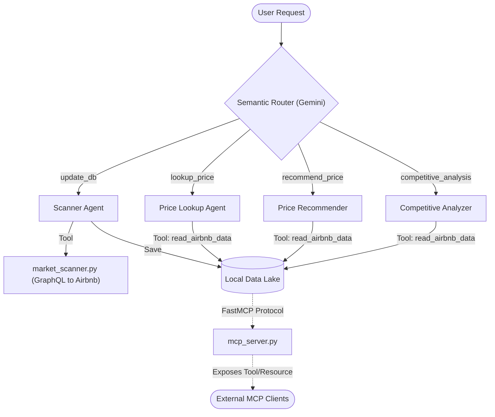
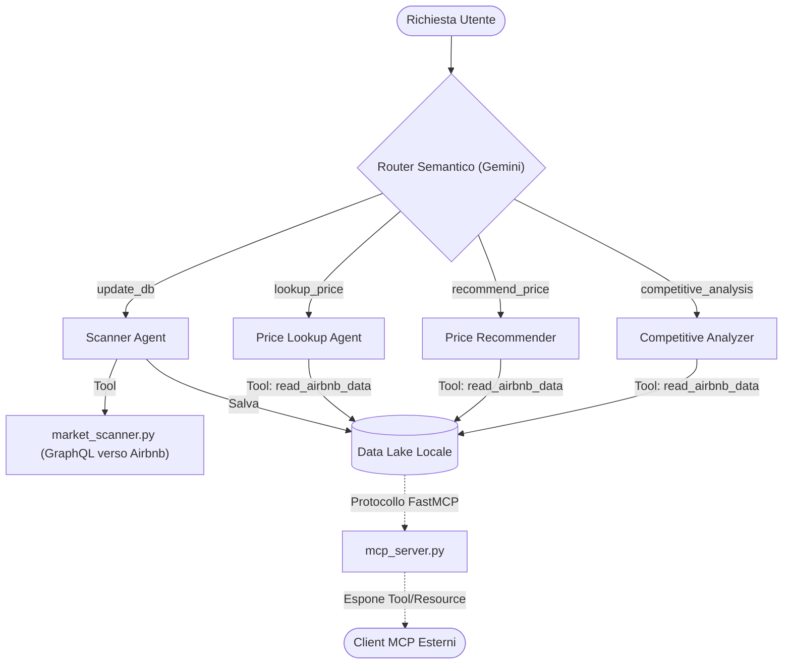

# Mr. Airbnb: The Autonomous Market Intelligence Agent

*🇮🇹 Scorri verso il basso per la versione in Italiano.*

**Subtitle**: Leveraging AI Agents to overcome dynamic pricing obscurity and optimize short-term rental strategies.

**Selected Track**: AI Agents for Business Productivity (or Open Innovation)

---

## 🏆 Kaggle Evaluation Mapping
This project explicitly fulfills the following Key Concepts required for the submission:
1. **Agent / Multi-agent system (ADK) -> Code**: Implemented a Graph-based Semantic Router that delegates tasks to 4 specialized `LlmAgents` in `app/agent.py`.
2. **MCP Server -> Code**: A fully functional local FastMCP server (`mcp_server.py`) is included to securely expose the local JSON database to external LLM clients.
3. **Security features -> Code**: `app/market_scanner.py` includes robust RegEx validation to sanitize inputs and prevent injection or type-crash vulnerabilities when parsing dates from user/LLM prompts.
4. **Agent Skills (Agents CLI) -> Code**: The `run_market_scanner` acts as a complex Skill wrapper that navigates dynamic minimum-stay blocks autonomously.

---

## 🇬🇧 English Version

### 1. The Problem: The Obscurity of the Short-Term Rental Market
In the highly competitive short-term rental market (Airbnb, Booking), competitive analysis is crucial. However, extracting the "true" nightly price of a competitor has become a mathematical and technical nightmare.

Airbnb uses an obscure pricing structure where the pure rate (what the host actually earns or sets as a base) is hidden behind a complex series of dynamic variables:
- Fixed or variable cleaning fees.
- Tourist taxes dependent on location and number of guests.
- Guest service fees (often dynamic and hidden in the gross total).
- Minimum Stay rules that block the display of prices for single-night searches.
- Special discounts and last-minute promotions.

For a host wishing to price their apartment competitively, manual analysis requires dozens of cross-searches, algebraic calculations to separate fixed costs, and attempts to overcome time blocks.

### 2. The Solution: Mr. Airbnb
To solve this problem, we developed **Mr. Airbnb**, an autonomous multi-agent system based on the Google Agents framework (ADK).

Mr. Airbnb is not just a scraper, but a true strategic consultant. Interacting in natural language, the user can ask the agent to update market data, check a specific rate, or provide advice on how to price their apartment for a given weekend.

The agent handles all the "dirty work":
- Bypasses anti-bot blocks (429 Errors) through intelligent GraphQL request management.
- Finds availability by circumventing Minimum Stays (iteratively exploring wider date windows).
- Applies a Reverse Pricing algorithm to deduce the base pure rate, deducting taxes, known cleaning costs (via dictionary), and commissions.
- Stores historical data in a local Data Lake for future analysis.

### 3. Architecture and Technical Implementation
The project architecture is based on a Graph-based Workflow and an intelligent Router driven by Google DeepMind's Gemini models.



#### A. The Semantic Router (Classifier)
Instead of relying on rigid commands, the main interface uses an LLM node (Gemini 2.5 Flash) configured as a Routing Agent. It receives user input and classifies it into one of the available workflows:
- `update_db`: To launch new scans.
- `lookup_price`: To query the database for specific dates and apartments.
- `recommend_price`: To get strategic pricing suggestions.
- `competitive_analysis`: To generate comparative reports.

#### B. The Specialized Sub-Agents
Traffic is routed to four highly specialized `LlmAgent`s:
- **Scanner Agent**: Has access to the `run_market_scanner` tool. When activated, it orchestrates GraphQL calls to the Airbnb API. It can handle timeouts and format raw data into a JSON file.
- **Price Lookup Agent**: Specialized in reading the local database. It knows the codenames of competitor apartments (e.g., "Navona", "Elegante") and extracts pure rates and active special offers for a given date.
- **Price Recommender & Competitive Analyzer**: Analytical agents that use extracted data to provide business consulting. They evaluate the host's positioning against historical competitors and suggest price adjustments.

#### C. The Reverse Pricing Tool
The technical heart of the project is the `market_scanner` module. This script simulates a complete `StaysPdpBookItQuery` request. When an apartment has a 3-night minimum stay block, the script dynamically detects it, widens the search window to 4, 5, up to 7 nights, collects the total gross price, and uses algebra to trace back to the cost of a single night.

### 4. Impact and Future Developments
Mr. Airbnb demonstrates how AI Agents can transform tedious workflows that are impossible for a human (like dynamic reverse engineering of hundreds of prices) into a simple conversation.

Currently, the system operates on a local environment (Playground) with a JSON file acting as a Data Lake. Next steps will include:
- Integration of a vector database for more complex chronological queries.
- Deployment of the agent on Google Cloud (Vertex AI).
- Addition of Actions to allow the agent to autonomously update prices on the host's calendar.

---

### 🚀 Setup Instructions

#### Prerequisites
- **Python 3.10+**
- **uv**: Extremely fast Python package manager. [Install uv here](https://docs.astral.sh/uv/getting-started/installation/).
- **Git**
- **Google Cloud SDK**: For GCP deployment services - [Install](https://cloud.google.com/sdk/docs/install)

#### 1. Clone the Repository
```bash
git clone https://github.com/Maurodipa/mr-airbnb.git
cd mr-airbnb
```

#### 2. Environment Variables
Create a file named `.env` in the root of the project:
```env
# .env file
GEMINI_API_KEY="your-google-gemini-api-key"
GOOGLE_CLOUD_PROJECT="your-google-cloud-project-id"
```

#### 3. Install Dependencies
```bash
uv sync
```

#### 4. Run the Agent (Local Playground)
```bash
uvx google-agents-cli playground
```
Once the server starts, open your browser to `http://127.0.0.1:8080/dev-ui/?app=app`.

---
## 💻 CLI Commands & Project Management
| Command              | Description                                                                                 |
| -------------------- | ------------------------------------------------------------------------------------------- |
| `agents-cli install` | Install dependencies using uv                                                         |
| `agents-cli playground` | Launch local development environment                                                  |
| `agents-cli lint`    | Run code quality checks                                                               |
| `agents-cli eval`    | Evaluate agent behavior |
| `uv run pytest tests/unit tests/integration` | Run unit and integration tests                                                        |
| `agents-cli scaffold enhance` | Add CI/CD pipelines and Terraform infrastructure |
| `agents-cli deploy` | Deploy agent to Google Cloud |

---
---

## 🏆 Requisiti Kaggle (Mappatura)
Questo progetto soddisfa esplicitamente i seguenti concetti chiave richiesti per la sottomissione:
1. **Agent / Multi-agent system (ADK)**: Implementato un Router Semantico a Grafo che delega compiti a 4 `LlmAgents` specializzati in `app/agent.py`.
2. **MCP Server**: È incluso un server FastMCP locale (`mcp_server.py`) completamente funzionante per esporre in modo sicuro il database JSON locale a client LLM esterni.
3. **Security features**: `app/market_scanner.py` include validazione RegEx per sanificare gli input e prevenire vulnerabilità di injection durante il parsing delle date.
4. **Agent Skills**: Il tool `run_market_scanner` agisce come una complessa "Skill" autonoma per aggirare le logiche anti-bot e i blocchi del Minimum Stay.

---

## 🇮🇹 Versione Italiana

### 1. Il Problema: L'Opacità del Mercato degli Affitti Brevi
Nel mercato altamente competitivo degli affitti brevi (Airbnb, Booking), l'analisi della concorrenza è fondamentale. Tuttavia, estrarre il "vero" prezzo per notte di un competitor è diventato un incubo matematico e tecnico.

Airbnb utilizza una struttura di prezzi opaca in cui la tariffa pura (ciò che l'host effettivamente incassa o imposta come base) è nascosta dietro a una serie complessa di variabili dinamiche:
- Costi di pulizia fissi o variabili.
- Tasse di soggiorno dipendenti dalla località e dal numero di ospiti.
- Commissioni di servizio per l'ospite (spesso dinamiche e nascoste nel totale lordo).
- Regole di Minimum Stay (soggiorno minimo) che bloccano la visualizzazione dei prezzi per ricerche di singole notti.
- Sconti speciali e promozioni dell'ultimo minuto.

Per un host che desidera prezzare il proprio appartamento in modo competitivo, fare un'analisi manuale richiede decine di ricerche incrociate, calcoli algebrici per scorporare i costi fissi e tentativi per superare i blocchi temporali.

### 2. La Soluzione: Mr. Airbnb
Per risolvere questo problema, abbiamo sviluppato **Mr. Airbnb**, un sistema multi-agente autonomo basato sul framework Google Agents (ADK).

Mr. Airbnb non è solo uno scraper, ma un vero e proprio consulente strategico. Interagendo in linguaggio naturale, l'utente può chiedere all'agente di aggiornare i dati di mercato, verificare una tariffa specifica o fornire consigli su come prezzare il proprio appartamento per un determinato weekend.

L'agente si occupa di tutto il "lavoro sporco":
- Aggira i blocchi anti-bot (Errori 429) tramite una gestione intelligente delle richieste GraphQL.
- Trova le disponibilità eludendo i Minimum Stay (esplorando iterativamente finestre di date più ampie).
- Applica un algoritmo di Reverse Pricing per dedurre la tariffa pura di base, scorporando tasse, costi di pulizia noti (tramite dizionario) e commissioni.
- Memorizza i dati storici in un Data Lake locale per analisi future.

### 3. Architettura e Implementazione Tecnica
L'architettura del progetto si basa su un Workflow basato su Grafi e un Router intelligente guidato dai modelli Gemini di Google DeepMind.



#### A. Il Router Semantico (Classifier)
Invece di affidarsi a comandi rigidi, l'interfaccia principale utilizza un nodo LLM (Gemini 2.5 Flash) configurato come Routing Agent. Riceve l'input dell'utente e lo classifica in uno dei flussi di lavoro disponibili:
- `update_db`: Per lanciare nuove scansioni.
- `lookup_price`: Per interrogare il database su specifiche date e appartamenti.
- `recommend_price`: Per ottenere suggerimenti strategici di prezzo.
- `competitive_analysis`: Per generare report comparativi.

#### B. I Sotto-Agenti Specializzati
Il traffico viene deviato a quattro LlmAgent altamente specializzati:
- **Scanner Agent**: Ha accesso al tool `run_market_scanner`. Quando attivato, orchestra chiamate GraphQL all'API di Airbnb. È in grado di gestire i timeout e di formattare i dati grezzi in un file JSON.
- **Price Lookup Agent**: Specializzato nella lettura del database locale. Conosce i nomi in codice degli appartamenti competitor (es. "Navona", "Elegante") ed estrae le tariffe pure e le eventuali offerte speciali attive per una determinata data.
- **Price Recommender & Competitive Analyzer**: Agenti analitici che utilizzano i dati estratti per fornire consulenza aziendale. Valutano il posizionamento dell'host rispetto ai competitor storici e suggeriscono aggiustamenti di prezzo.

#### C. Lo Strumento di Reverse Pricing (Tool)
Il cuore tecnico del progetto è il modulo `market_scanner`. Questo script simula una richiesta `StaysPdpBookItQuery` completa. Quando un appartamento ha un blocco di minimum stay di 3 notti, lo script lo rileva dinamicamente, allarga la finestra di ricerca a 4, 5, fino a 7 notti, raccoglie il prezzo lordo totale e utilizza l'algebra per risalire al costo di una singola notte.

### 4. Impatto e Sviluppi Futuri
Mr. Airbnb dimostra come gli Agenti AI possano trasformare flussi di lavoro noiosi e impossibili per un essere umano (come il reverse engineering dinamico di centinaia di prezzi) in una semplice conversazione.

Attualmente il sistema opera su un ambiente locale (Playground) con un file JSON che funge da Data Lake. I prossimi passi includeranno:
- L'integrazione di un database vettoriale per interrogazioni cronologiche più complesse.
- Il deploy dell'agente su Google Cloud (Vertex AI).
- L'aggiunta di azioni (Actions) per permettere all'agente di aggiornare autonomamente i prezzi sul calendario dell'host.

---

### 🚀 Istruzioni di Setup

#### Prerequisiti
- **Python 3.10+**
- **uv**: Gestore di pacchetti Python. [Installa uv qui](https://docs.astral.sh/uv/getting-started/installation/).
- **Git**

#### 1. Clona il Repository
```bash
git clone https://github.com/Maurodipa/mr-airbnb.git
cd mr-airbnb
```

#### 2. Variabili d'Ambiente
Crea un file chiamato `.env` nella root del progetto:
```env
# file .env
GEMINI_API_KEY="la-tua-chiave-api-google-gemini"
GOOGLE_CLOUD_PROJECT="il-tuo-id-progetto-google-cloud"
```

#### 3. Installa le Dipendenze
```bash
uv sync
```

#### 4. Esegui l'Agente (Playground Locale)
```bash
uvx google-agents-cli playground
```
Apri il tuo browser e naviga al link fornito nel terminale (di solito `http://127.0.0.1:8080/dev-ui/?app=app`).

---

## 🛠️ Struttura del Progetto / Project Structure

```
mr-airbnb/
├── app/
│   ├── agent.py               # Logica principale, classificatore e LlmAgents
│   ├── market_scanner.py      # Core dello scraping e logica di reverse-pricing
│   ├── tools.py               # Wrapper dei tool per gli agenti
│   └── app_utils/             # Utility e helper dell'app
├── tests/                     # Test unitari e di integrazione
├── banca_dati_airbnb.json     # Data Lake Grezzo (ignorato in git)
├── market_data_1month.json    # Tariffe pure elaborate (ignorato in git)
├── pyproject.toml             # Definizione delle dipendenze del progetto
└── README.md                  # Questo file
```

*Disclaimer: Questo progetto è inteso per scopi educativi e di ricerca di mercato come parte di un Hackathon (Kaggle 5-Day AI Agents).*
